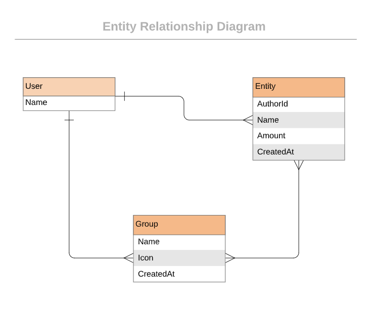

<!-- Insert an image from the current directory -->



<a name="readme-top"></a>

<!-- TABLE OF CONTENTS -->

# 📗 Table of Contents

- [📗 Table of Contents](#-table-of-contents)
- [📖 SpendWise](#-about-project-)
  - [🛠 Built With ](#-built-with-)
    - [Tech Stack ](#tech-stack-)
    - [Key Features ](#key-features-)
  - [💻 Getting Started ](#-getting-started-)
    - [Prerequisites](#prerequisites)
    - [Setup](#setup)
    - [Install](#install)
    - [Usage ](#usage-)
    - [Run tests ](#run-tests-)
    - [Deployment ](#deployment-)
  - [👥 Authors ](#-authors-)
  - [🔭 Future Features ](#-future-features-)
  - [🤝 Contributing ](#-contributing-)
  - [⭐️ Show your support ](#️-show-your-support-)
  - [🙏 Acknowledgments ](#-acknowledgments-)
  - [📝 License ](#-license-)

<!-- PROJECT DESCRIPTION -->

# 📖 [SpendWise] <a name="about-project"></a>

You are welcome to **[SpendWise](https://spendwise-jrzs.onrender.com)**. SpendWise is a mobile web application designed to help users efficiently manage their budgets and track expenses. With an intuitive and user-friendly interface, this app enables individuals to gain insights into their spending habits and make informed financial decisions.


## 🛠 Built With <a name="built-with"></a>

### Tech Stack <a name="tech-stack"></a>

<details>
  <summary>Client</summary>
  <ul>
    <li>RUBY</li>
    <li>RAILS</li>
  </ul>
</details>

<!-- Features -->

### Key Features <a name="key-features"></a>

- User Registration and Authentication: Allow users to register and create accounts securely. Implement authentication mechanisms to ensure only registered users can access their budget and expense data.

- Budget Creation and Management: Enable users to set up and manage their budgets. Users should be able to define budget categories and allocate funds to each category.

- Expense Tracking: Provide users with the ability to log their expenses and categorize them accordingly. Users should be able to enter transaction details like date, amount, and category.

- Budget Visualization: Present budget information using charts or graphs to help users visualize their spending patterns, track progress, and identify areas of overspending.

- Expense Insights and Analytics: Offer users insights and analytics based on their spending history. This could include trends, monthly summaries, and comparisons to help users make better financial decisions.

<p align="right">(<a href="#readme-top">back to top</a>)</p>

<!-- GETTING STARTED -->

## 💻 Getting Started <a name="getting-started"></a>

To get a local copy up and running, follow these steps.

<p align="right">(<a href="#readme-top">back to top</a>)</p>

### Prerequisites

In order to run this project you need:

<ul>
    <li>The current version of node</li>
    <li>To have Git installed on your local machine</li>
    <li>Node Package manager (npm) </li>
    <li>An editor such as Visual Studio Code</li>
  </ul>

<p align="right">(<a href="#readme-top">back to top</a>)</p>

### Setup

Clone this repository to your desired folder:

<ul>
    <li>Create your classic access token from github.com</li>
    <li>run "git clone https://{access_token}@github.com/username/{repo_name}.git"</li>
    <li>Update your git identity by running "git config --global user.email "your_email@gmail.com""</li>
    <li>Update your name on git by running "git config --global user.name "your_name"</li>
  </ul>

  <p align="right">(<a href="#readme-top">back to top</a>)</p>

### Install

To install this project, run

```sh

bundle install

```


### Run tests <a name="run-tests"></a>

To run tests, run the following command:

```sh

Run "rubocop --fix to fix linters"
```

or

```sh

Run "rubocop -A to fix linters"
```


<p align="right">(<a href="#readme-top">back to top</a>)</p>

### Deployment <a name="triangular_flag_on_post-deployment"></a>

You can deploy this project using:

- render


<p align="right">(<a href="#readme-top">back to top</a>)</p>

### Live Demo <a name="triangular_flag_on_post-deployment"></a>

For a live demo of the Spendwise application, please use this [link](https://spendwise-jrzs.onrender.com)


<p align="right">(<a href="#readme-top">back to top</a>)</p>

<!-- AUTHORS -->

## 👥 Author <a name="authors"></a>

👤 **Author: Damilare**
| Availale Social Media | Link                                      |
|--------------|-------------------------------------------|
| GitHub       | [@githubhandle](https://github.com/Bestbynature)     |
| Twitter      | [@twitterhandle](https://twitter.com/Dammybest)     |
| LinkedIn     | [LinkedIn](https://www.linkedin.com/in/damilareismailabestbynature/) |


<p align="right">(<a href="#readme-top">back to top</a>)</p>

<!-- FUTURE FEATURES -->

## 🔭 Future Features <a name="future-features"></a>

- [x] Reports and Exporting: Allow users to generate and export financial reports in various formats, such as PDF or CSV, for further analysis or record-keeping.

- [x] Goal Setting and Savings Tracking: Provide functionality for users to set financial goals and track progress towards achieving them. This could include savings goals, debt reduction targets, etc.

- [x] Multi-Currency Support: If your app targets an international audience, consider adding support for multiple currencies to handle expenses incurred in different currencies.

<p align="right">(<a href="#readme-top">back to top</a>)</p>

<!-- CONTRIBUTING -->

## 🤝 Contributing <a name="contributing"></a>

Contributions, issues, and feature requests are welcome!

Feel free to check the [issues page](../../issues/).

<p align="right">(<a href="#readme-top">back to top</a>)</p>

<!-- SUPPORT -->

## ⭐️ Show your support <a name="support"></a>

If you like this project, kindly drop a star for me.

<p align="right">(<a href="#readme-top">back to top</a>)</p>

<!-- ACKNOWLEDGEMENTS -->

## 🙏 Acknowledgments <a name="acknowledgements"></a>

 Original design idea by [Gregoire Vella](https://www.behance.net/gregoirevella) on Behance.

<p align="right">(<a href="#readme-top">back to top</a>)</p>

<!-- LICENSE -->

## 📝 License <a name="license"></a>

This project is [MIT](./LICENSE) licensed.

<p align="right">(<a href="#readme-top">back to top</a>)</p>
